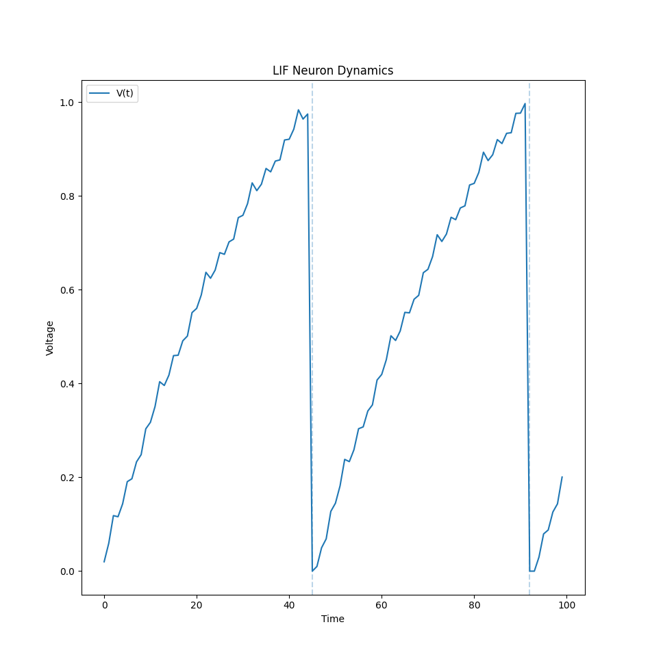
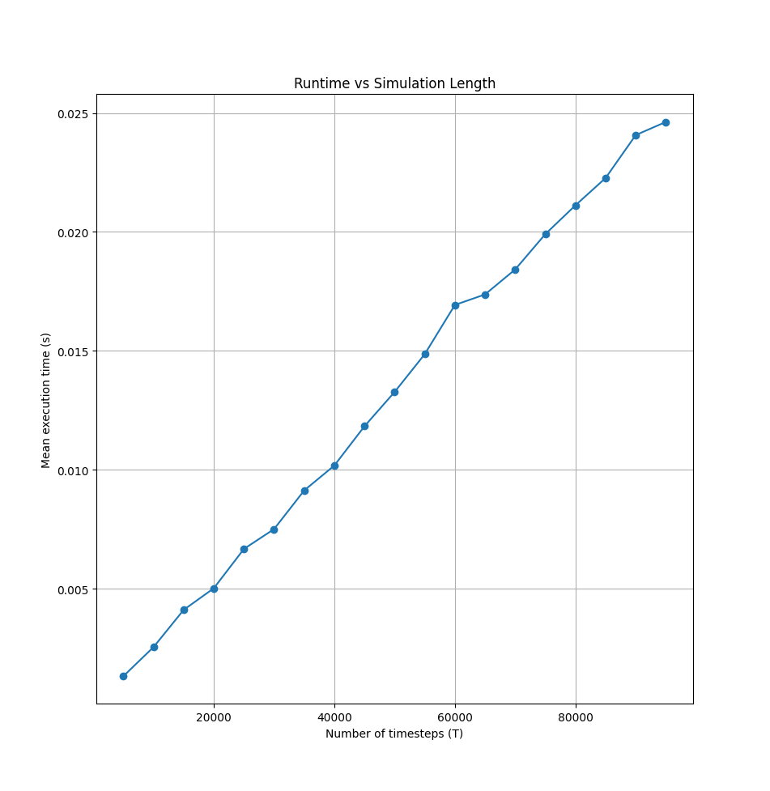
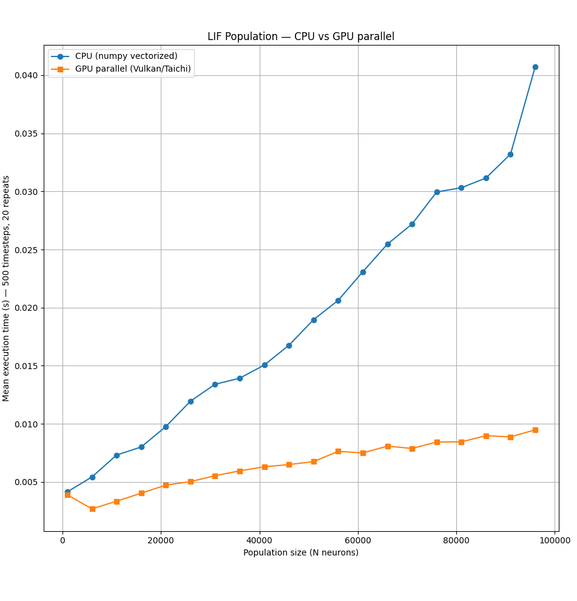
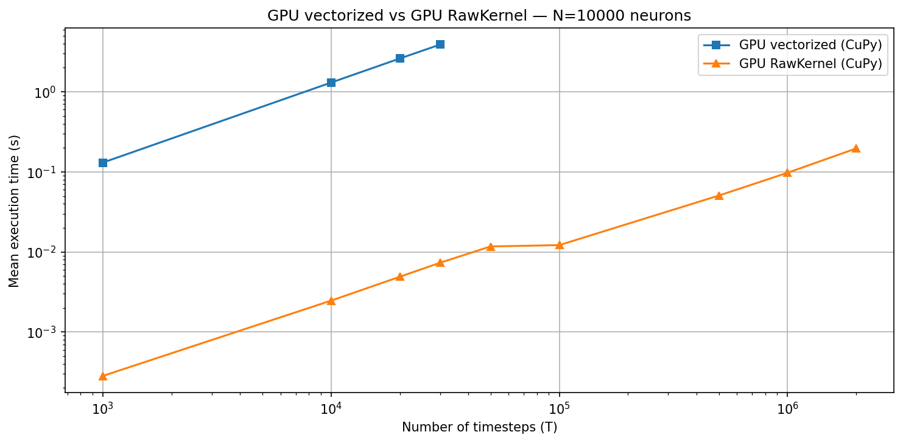
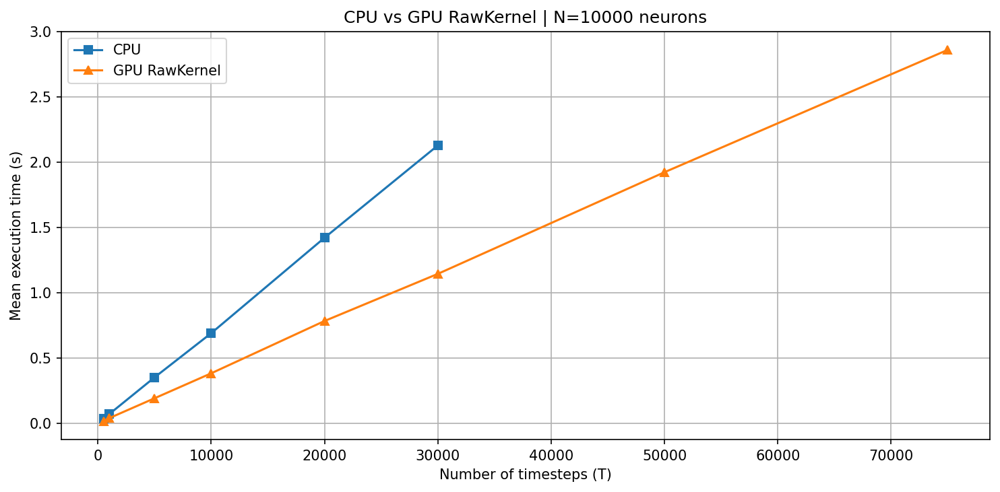
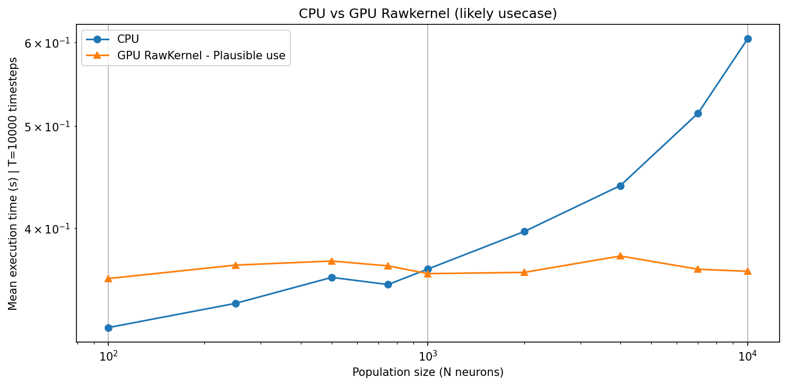
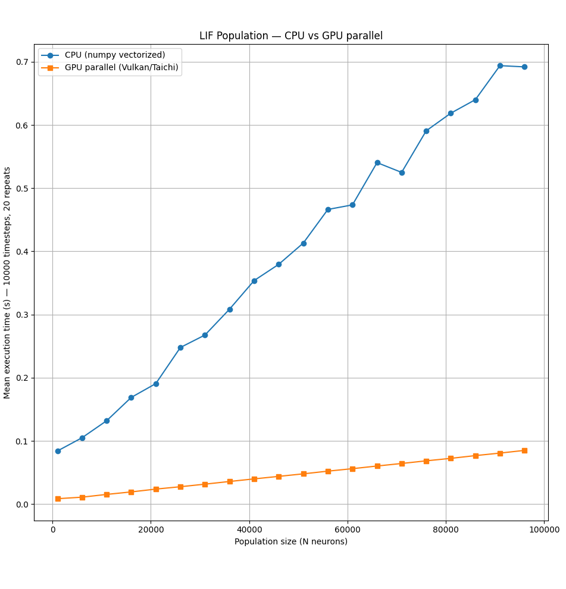

# Task C: GPU Kernel Skeleton for LIF Neuron Simulation

**BAINSA SNN Project, Sprint 1**  
Assigned to: Jacopo Gonzini

## Overview

This task implements a Leaky Integrate-and-Fire (LIF) neuron model with both CPU and GPU execution paths. The work is split into three parts:

- **C.1**: a minimal single-neuron LIF simulator in pure Python
- **C.2**: a population-level implementation with CPU and GPU backends
  - **Taichi/Vulkan** for local machines without NVIDIA GPUs
  - **CuPy RawKernel** for CUDA environments
- **C.3**: benchmarks comparing CPU and GPU performance across neuron counts and simulation lengths, both for a fully fused simulation (`run()`) and for the step-by-step RL-style case (`forward()`)

## LIF neuron model

All implementations use the same discrete-time update rule:

```python
V[t+1] = beta * V[t] + I[t]
if V[t+1] >= V_th:
    spike = 1
    V[t+1] = V[t+1] - V_th
else:
    spike = 0
```

### Parameters

| Parameter | Value | Description |
|---|---:|---|
| `beta` | 0.9 | membrane decay factor |
| `V_th` | 1.0 | firing threshold |
| reset | soft | subtract threshold instead of resetting to zero |
| `V_init` | 0.0 | initial membrane potential |

I used a soft reset (`V -= V_th`) rather than a hard reset. In practice this keeps any overshoot after threshold crossing, which gives slightly more regular firing and is closer to the standard LIF behavior used in SNN work.

## C.1: Pure Python LIF (single neuron)

`lif_pure_python.py` contains a minimal `Neuron` class with no third-party dependencies. It simulates a single neuron and measures runtime as a function of the number of timesteps `T`.

### Single-neuron dynamics



The voltage trace has the expected sawtooth shape: the membrane integrates the input, crosses threshold, emits a spike, and then drops by one threshold due to the soft reset. Because the reset keeps any residual voltage, the next spike can arrive a little earlier than it would with a hard reset.

### Runtime vs simulation length



For one neuron, runtime grows linearly with `T`, which is expected since the update is inherently sequential. At `T = 100,000`, the mean runtime is about **25 ms**.

## C.2: GPU kernel (`lif_kernel.py`)

`lif_kernel.py` defines a `LIFLayer` class for simulating a population of `N` independent LIF neurons in parallel. The public interface is the same across backends.

### Interface

```python
class LIFLayer:
    def __init__(self, n_neurons, beta=0.9, threshold=1.0, backend='cpu'): ...
    def forward(self, input_current: float) -> (spikes, membrane)
    def run(self, T, pattern) -> np.ndarray
    def reset(self): ...
```

### Backend A: Taichi / Vulkan

This version is intended for local execution on AMD or integrated GPUs through Vulkan, so it does not require CUDA. The full `T` loop lives inside the Taichi kernel for `run()`, which means each call launches one GPU kernel. In contrast, `forward()` launches one kernel per timestep.

Tested on:
- AMD Radeon Vega (Picasso / Raven 2)
- Taichi 1.7.4
- Python 3.12
- Linux / Vulkan

### Backend B: CuPy RawKernel

For CUDA environments, I implemented two kernels in CUDA C and compiled them through CuPy:

- `lif_step` for single-step execution in `forward()`
- `lif_run` for fused `T`-step execution in `run()`

The kernels are compiled once at import time, not once per layer instance.

```c
__global__ void lif_step(float* V, int* spikes, const float inp,
                         float beta, float threshold, int N) {
    int i = blockIdx.x * blockDim.x + threadIdx.x;
    if (i >= N) return;
    float v = beta * V[i] + inp;
    if (v >= threshold) { spikes[i] = 1; V[i] = v - threshold; }
    else                { spikes[i] = 0; V[i] = v; }
}

__global__ void lif_run(float* V, int* spike_counts, const float* pattern,
                        float beta, float threshold, int T, int pat_len, int N) {
    int i = blockIdx.x * blockDim.x + threadIdx.x;
    if (i >= N) return;
    float v = 0.0f;
    for (int t = 0; t < T; t++) {
        float inp = pattern[t % pat_len];
        v = beta * v + inp;
        if (v >= threshold) { spike_counts[i]++; v -= threshold; }
    }
    V[i] = v;
}
```

The CUDA index expression

```c
blockIdx.x * blockDim.x + threadIdx.x
```

assigns one thread to one neuron, which is the explicit CUDA equivalent of the loop index Taichi manages automatically.

## C.3: Benchmarks

Unless noted otherwise, the benchmark results below were collected on an **NVIDIA T4** in Kaggle with **`T = 10,000`**.

### 1. `run()`: CPU vs GPU, varying `N`

This is the best-case GPU setup because the whole simulation loop is fused into one kernel launch.



The RawKernel version stays around **2.5 ms** up to `N = 10,000`, and is still only about **12 ms** at `N = 100,000`. At that scale it is roughly **270x faster** than the CPU version.

```text
=== CPU ===
  N=1000     mean=0.1234s  std=0.0024s  min=0.1206s  max=0.1265s
  N=10000    mean=0.3551s  std=0.0128s  min=0.3402s  max=0.3722s
  N=100000   mean=3.2512s  std=0.0448s  min=3.1946s  max=3.3109s

=== GPU run() ===
  N=1000     mean=0.0025s  std=0.0000s  min=0.0025s  max=0.0025s
  N=10000    mean=0.0025s  std=0.0000s  min=0.0025s  max=0.0025s
  N=100000   mean=0.0119s  std=0.0000s  min=0.0119s  max=0.0119s
```

The main reason is that `run()` pays the Python-to-GPU launch cost once, and then all timesteps execute on-device.

### 2. Ideal workspace: vectorized GPU vs RawKernel, varying `T`

The core issue with RawKernel here is that in this version it is coded to run all the T steps at the same time, and this wouldn't obviously be feasible or useful in a training setup. Nonetheless, it shows how much the python loop influences the time cost.



Both methods scale linearly with `T`, but the difference in constant overhead is large. At `T = 30,000`, the vectorized version takes about **3 s**, while the fused RawKernel takes about **5 ms**.
The greatest way to see this plot it through a logarithmic scale.

That gap does not close as `T` grows, because the vectorized version still launches work from Python at every timestep. The RawKernel version launches once and keeps the full time loop inside the kernel.

### 3. `forward()`: CPU vs GPU, varying `T`

This is closer to the RL use case, where the environment calls `forward()` once per timestep.



Here the picture changes. Both CPU and GPU times grow linearly with `T`, and the slopes are fairly close. The GPU is only modestly faster because each call still pays the Python to CUDA to Python round trip.

At `T = 30,000`:
- **CPU:** about **1.9 s**
- **GPU:** about **1.1 s**

So in this setting the speedup is only about **1.7x**, not hundreds of times faster.

For `forward()`, the bottleneck is mostly launch overhead rather than arithmetic.

### 4. `forward()`: CPU vs GPU, varying `N`

This is probably the most useful benchmark for integration: how large does the population need to be before the GPU actually helps?



Looking at some raw data:
```text
=== CPU forward() ===
  N=1000     mean=0.3689s  std=0.0036s
  N=10000    mean=0.6272s  std=0.0062s
  N=100000   mean=3.5560s  std=0.0313s

=== GPU forward() ===
  N=1000     mean=0.3767s  std=0.0079s
  N=10000    mean=0.3690s  std=0.0014s
  N=100000   mean=0.4036s  std=0.0071s
```

The crossover point is around **`N ≈ 1000`**. It happened to vary based on the run though, ranging from 500 to 1000. 

Below that, GPU launch overhead dominates and the CPU is slightly faster. Above that, the GPU starts to pull ahead because the per-neuron work is finally large enough to amortize the dispatch cost.

One useful detail is that the GPU curve is almost flat between `N = 1,000` and `N = 100,000`, roughly **0.37 to 0.40 s** across the whole range. On the T4, increasing `N` in this range barely changes wall-clock time because the loop overhead in Python is still the limiting factor. The CPU version, by contrast, scales more or less linearly with `N` because the NumPy work itself keeps growing.

For the RL environment, that suggests a simple rule: use the GPU backend only once the layer is large enough to justify the per-step launch cost.

### 5. Extra example: CPU vs local GPU, varying `N`

Hardware: **AMD Radeon Vega iGPU** on a local machine.



Unlike the T4 results, both curves increase with `N`. That is expected on an integrated GPU, since the CPU and GPU share system memory and bandwidth. Even so, the Taichi/Vulkan backend is still around **3 to 4x faster** than CPU at `N = 100,000`.

### Why the Vega iGPU and T4 behave differently

|  | AMD Vega iGPU | NVIDIA T4 |
|---|---|---|
| Compute resources | ~704 shader processors | 2,560 CUDA cores |
| Memory | shared system RAM | 16 GB dedicated GDDR6 |
| Bandwidth | ~40 GB/s shared | ~300 GB/s dedicated |
| GPU runtime curve | increases with `N` | nearly flat up to `N = 10,000` |
| Speedup at `N = 100k` | ~3 to 4x | ~270x |

The iGPU numbers are smaller, but still useful: they show that the parallelization strategy works and that the kernel logic behaves correctly outside CUDA. The T4 results are the better reference for larger SNN workloads.

## Setup

### Local setup (Taichi backend)

Taichi currently requires **Python 3.12** in this project setup.

```bash
uv venv --python 3.12 .venv
source .venv/bin/activate
uv pip install -r requirements.txt
```

### Usage
These 3 scripts come with the class definition and a little time measuring benchmark to test them.
```bash
# single-neuron dynamics
python lif_pure_python.py

# simple GPU parallel computation. Note to change the GPU name accordingly to the model
python lif_GPU_parallel.py

# CuPy RawKernel
python lif_kernel.py
```
Note that `lif_kernel.py` is the version discussed in C.3.3 and C.3.4, with a realistic forward step.
